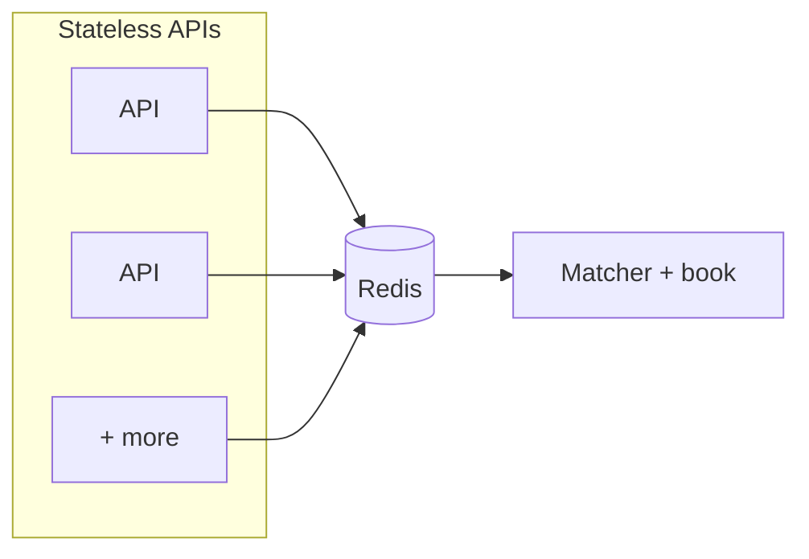
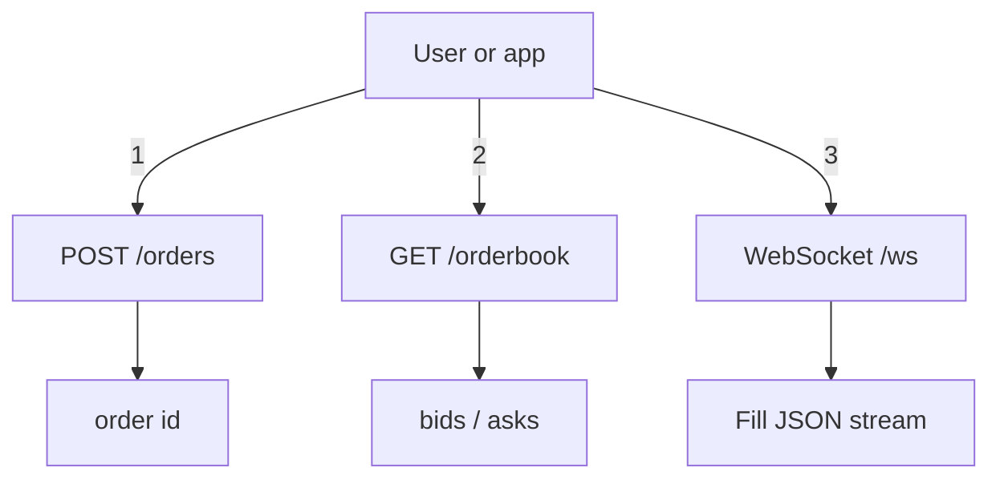

# Prediction market matcher (toy)

HTTP API, price–time matching, WebSocket fills, **multiple API instances** via Redis + one matcher.

## Video walkthrough (required)

Replace with your public 1–2 min URL:

`https://www.youtube.com/watch?v=REPLACE_ME`

## Architecture

| Piece | Role | Code |
|-------|------|------|
| **Redis** | Queue, reply lists, pub/sub | `docker compose`, [`protocol`](src/lib.rs) |
| **Matcher** | Order book, matching, `GET /orderbook` | [`src/bin/matcher.rs`](src/bin/matcher.rs) |
| **API** | Stateless: orders, proxy orderbook, WebSocket | [`src/main.rs`](src/main.rs) |

### Multiple API instances



### User flow



**Internals:** APIs `RPUSH` orders to Redis; **one** matcher `BRPOP`s, matches, `PUBLISH`es fills, returns id via a reply list. `GET /orderbook` is proxied to the matcher. Each API `SUBSCRIBE`s fills and forwards to its WebSockets.

## Run locally

**Rust**, **Docker** (Redis).

```bash
docker compose up -d
```

**Terminal 1 — matcher**

```bash
REDIS_URL=redis://127.0.0.1:6379 cargo run --bin matcher
```

**Terminal 2 — API**

```bash
REDIS_URL=redis://127.0.0.1:6379 MATCHER_HTTP_URL=http://127.0.0.1:4001 cargo run
```

```bash
curl -s http://127.0.0.1:3000/orderbook
curl -s -X POST http://127.0.0.1:3000/orders -H 'Content-Type: application/json' \
  -d '{"side":"buy","price":100,"qty":1}'
```

[`.env.example`](.env.example) lists env vars.

**Two APIs (different ports, same Redis + matcher):**

```bash
REDIS_URL=redis://127.0.0.1:6379 MATCHER_HTTP_URL=http://127.0.0.1:4001 API_ADDR=0.0.0.0:3000 cargo run
```

```bash
REDIS_URL=redis://127.0.0.1:6379 MATCHER_HTTP_URL=http://127.0.0.1:4001 API_ADDR=0.0.0.0:3001 cargo run
```

## HTTP API

| Method | Path | Description |
|--------|------|---------------|
| `POST` | `/orders` | `{ "side", "price", "qty" }` → `{ "id" }` |
| `GET` | `/orderbook` | `{ "bids", "asks" }` (per-price totals) |
| `GET` | `/ws` | Text messages: each **fill** JSON |

## Design questions (assignment)

### 1. How does the system handle multiple API server instances without double-matching an order?

Only the **matcher** matches. APIs **RPUSH** to Redis; a **single** matcher **BRPOP**s the queue. Fills go out on **Redis pub/sub** so every API can fan out to WebSockets without duplicating matching.

### 2. What data structure did you use for the order book and why?

**Bids:** `BTreeMap<Reverse<price>, VecDeque<Order>>`. **Asks:** `BTreeMap<price, VecDeque<Order>>`. Sorted price levels + FIFO per level.

### 3. What breaks first if this were under real production load?

Matcher throughput, Redis, no persistence, blocking/timeouts on queue replies, WebSocket fanout.

### 4. What would you build next if you had another 4 hours?

WAL + snapshot, metrics, stricter validation, Redis integration tests, backpressure on pub/sub.

## Development

```bash
cargo test
cargo clippy --all-targets
```
