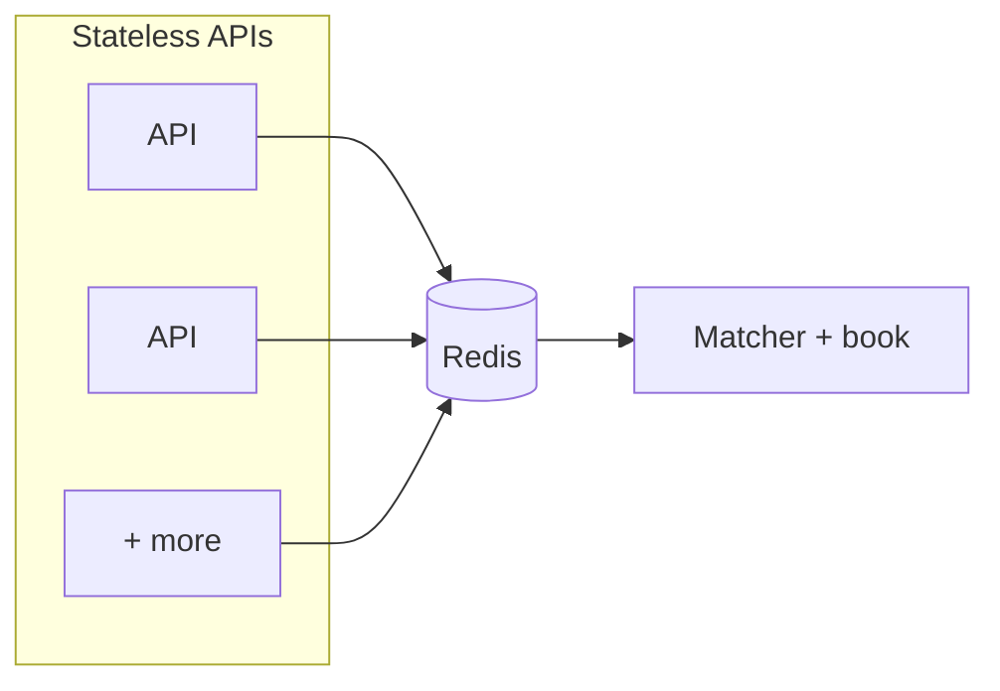
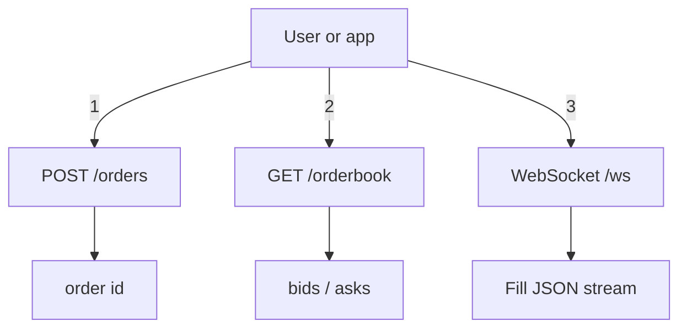

# Prediction market matcher (toy)

HTTP API, price–time matching, WebSocket fills, **multiple API instances** via Redis + one matcher.

## Video walkthrough (required)

Replace with your public 1–2 min URL:

`https://www.youtube.com/watch?v=Ap5nkPw566E`

## Architecture

| Piece | Role | Code |
|-------|------|------|
| **Redis** | Queue, reply lists, pub/sub | `docker compose`, [`protocol`](src/lib.rs) |
| **Matcher** | Order book, matching, `GET /orderbook` | [`src/bin/matcher.rs`](src/bin/matcher.rs) |
| **API** | Stateless: orders, proxy orderbook, WebSocket | [`src/main.rs`](src/main.rs) |

### Multiple API instances



### User flow



**Internals:** APIs `RPUSH` orders to Redis; **one** matcher `BRPOP`s, matches, `PUBLISH`es fills, returns id via a reply list. `GET /orderbook` is proxied to the matcher. Each API `SUBSCRIBE`s fills and forwards to its WebSockets.

## Run locally

**Rust**, **Docker** (Redis). Defaults match local dev—**you do not need to set `REDIS_URL` in the shell** unless Redis or ports differ.

| If unset | Default |
|----------|---------|
| `REDIS_URL` | `redis://127.0.0.1:6379` |
| `MATCHER_HTTP_ADDR` | `0.0.0.0:4001` (matcher HTTP) |
| `MATCHER_HTTP_URL` | `http://127.0.0.1:4001` (API → matcher) |
| `API_ADDR` | `0.0.0.0:3000` (API HTTP) |

Optional: copy [`.env.example`](.env.example) to **`.env`** (gitignored); both binaries load it automatically via [`dotenvy`](https://crates.io/crates/dotenvy).

```bash
docker compose up -d
```

**Terminal 1 — matcher**

```bash
cargo run --bin matcher
```

**Terminal 2 — API**

```bash
cargo run
```

```bash
curl -s http://127.0.0.1:3000/orderbook
curl -s -X POST http://127.0.0.1:3000/orders -H 'Content-Type: application/json' \
  -d '{"side":"buy","price":100,"qty":1}'
```

### Postman / Insomnia / browser

Base URL: **`http://127.0.0.1:3000`** (same defaults—no env in the client).

- `GET http://127.0.0.1:3000/orderbook`
- `POST http://127.0.0.1:3000/orders` — Body → raw JSON → `{"side":"buy","price":100,"qty":1}`

WebSocket URL: **`ws://127.0.0.1:3000/ws`**

**Second API instance** (e.g. port 3001): `API_ADDR=0.0.0.0:3001 cargo run` in another terminal (still use the same Redis + matcher).

## HTTP API

| Method | Path | Description |
|--------|------|---------------|
| `POST` | `/orders` | `{ "side", "price", "qty" }` → `{ "id" }` |
| `GET` | `/orderbook` | `{ "bids", "asks" }` (per-price totals) |
| `GET` | `/ws` | Text messages: each **fill** JSON |

## Design questions (assignment)

### 1. How does the system handle multiple API server instances without double-matching an order?

Only the **matcher** matches. APIs **RPUSH** to Redis; a **single** matcher **BRPOP**s the queue. Fills go out on **Redis pub/sub** so every API can fan out to WebSockets without duplicating matching.

### 2. What data structure did you use for the order book and why?

**Bids:** `BTreeMap<Reverse<price>, VecDeque<Order>>`. **Asks:** `BTreeMap<price, VecDeque<Order>>`. Sorted price levels + FIFO per level.

### 3. What breaks first if this were under real production load?

Matcher throughput, Redis, no persistence, blocking/timeouts on queue replies, WebSocket fanout.

### 4. What would you build next if you had another 4 hours?

I would focus on removing the biggest architectural limitation first: the matcher being a **single bottleneck**.

Right now, correctness is guaranteed by having a single matcher process, but this limits throughput and makes the system fragile under load.

If I had more time, I would:

1. **Partition the orderbook (horizontal scaling)**  
   Split the system by market (or instrument), so each partition has its own independent matcher. This allows matching to scale horizontally while preserving price-time priority within each market.

2. **Introduce a durable event log (WAL)**  
   Instead of relying purely on in-memory state + Redis, I would persist all orders and fills to an append-only log. This enables recovery, replay, and auditing — critical for any trading system.

3. **Decouple ingestion from matching via a queue**  
   Replace direct Redis list usage with a more explicit message queue (e.g., streams or Kafka-like abstraction), making backpressure and retries more predictable.

4. **Reduce latency in the hot path**  
   Move the orderbook fully in-memory inside the matcher and minimize Redis round trips, using Redis only for coordination and pub/sub.

5. **Add idempotency + exactly-once semantics**  
   Ensure duplicate order submissions (due to retries or network issues) do not create duplicate executions.

The goal of these changes is to evolve the system from a correct prototype into something that can scale without sacrificing determinism or consistency.

## Development

```bash
cargo test
cargo clippy --all-targets
```
