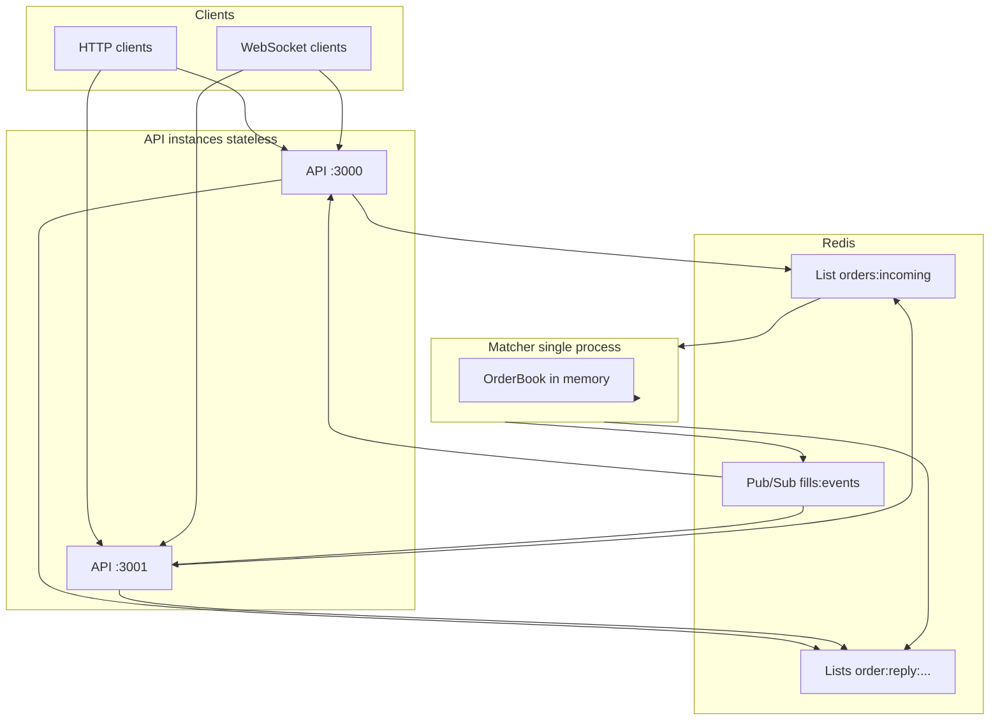
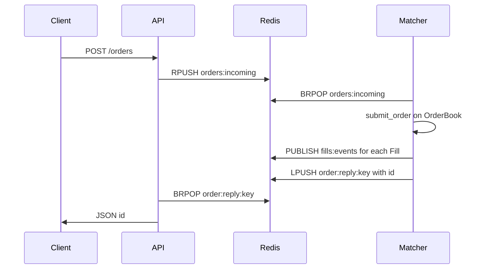

# Prediction market matcher (toy)

A small **prediction-market order matcher**: HTTP API for orders, **price–time** matching, **WebSocket** fill feed, and **multiple API instances** coordinated through Redis and a single matcher process.

## Video walkthrough (required)

**Add your public 1–2 minute YouTube URL here after you record:**

`https://www.youtube.com/watch?v=REPLACE_ME`

## Architecture

The system splits **HTTP/WebSocket frontends** (horizontally scalable) from **matching** (single logical writer). Only the matcher holds the [`OrderBook`](src/lib.rs); API processes never match locally, so many API instances can run in parallel without double-matching.

### Components

| Piece | Role | Code |
|-------|------|------|
| **Redis** | Shared queue, reply lists, and pub/sub for fills | `docker compose`, [`protocol`](src/lib.rs) constants |
| **Matcher** (`matcher` binary) | Consumes the order queue, assigns IDs, runs `submit_order`, publishes fills, serves authoritative **`GET /orderbook`** | [`src/bin/matcher.rs`](src/bin/matcher.rs) |
| **API** (`prediction-matcher` binary) | Stateless: enqueue orders, wait for id, proxy orderbook, fan out fills over WebSocket | [`src/main.rs`](src/main.rs) |

### High-level diagram



### Flow: `POST /orders`

1. Client sends JSON `{ side, price, qty }` to **any** API instance.
2. API builds a **`reply_key`** (unique per request), **`RPUSH`**es a [`QueuedOrder`](src/lib.rs) JSON to **`orders:incoming`**, then **`BRPOP`**s on **`order:reply:{reply_key}`** (with timeout) for the assigned id.
3. The **matcher** loop **`BRPOP`**s from **`orders:incoming`** (one message at a time), assigns **`id`**, runs **`OrderBook::submit_order`**, **`PUBLISH`**es each resulting **`Fill`** JSON to **`fills:events`**, then **`LPUSH`**es the stringified **`id`** onto **`order:reply:{reply_key}`** so the blocked API call unblocks.
4. API returns **`{ "id": … }`** to the client.

Only the matcher pops from **`orders:incoming`**, so each order is processed **exactly once** no matter how many APIs enqueue.



### Flow: `GET /orderbook`

1. Client calls **`GET /orderbook`** on an API instance.
2. API performs an **outgoing HTTP GET** to **`{MATCHER_HTTP_URL}/orderbook`** (see [`get_orderbook`](src/main.rs)).
3. Matcher returns the current snapshot from its **`OrderBook`**; API forwards JSON unchanged.

There is a **single source of truth** for the book (the matcher), so all API instances return a consistent view when pointed at the same matcher.

### Flow: WebSocket fills (`GET /ws`)

1. Each API instance runs a background task that **`SUBSCRIBE`**s to Redis **`fills:events`**.
2. On each message, it forwards the fill JSON to **all WebSocket connections** on that instance via an in-memory **broadcast** channel.
3. Clients connect to **`/ws`** on whichever API they use; they see **real-time fills** without the API performing matching.

### Why multiple API instances are safe

- **Matching** is serialized in **one matcher** behind a mutex on the book.
- **APIs** only talk to Redis and HTTP to the matcher; they store **no** authoritative order book.
- **Fills** are emitted once by the matcher and **fan out** to every API via pub/sub, so every region/instance can update its own WebSockets.

**Operational constraint:** run **one** matcher (or one consumer of **`orders:incoming`**) per market/book; run **N** API processes behind a load balancer as needed.

## Run locally

Prerequisites: **Rust**, **Docker** (for Redis).

1. **Redis**

   ```bash
   docker compose up -d
   ```

2. **Matcher** (terminal 1)

   ```bash
   REDIS_URL=redis://127.0.0.1:6379 cargo run --bin matcher
   ```

3. **API** (terminal 2; default binary is the API)

   ```bash
   REDIS_URL=redis://127.0.0.1:6379 MATCHER_HTTP_URL=http://127.0.0.1:4001 cargo run
   ```

4. **Smoke test**

   ```bash
   curl -s http://127.0.0.1:3000/orderbook
   curl -s -X POST http://127.0.0.1:3000/orders \
     -H 'Content-Type: application/json' \
     -d '{"side":"buy","price":100,"qty":1}'
   ```

Environment variables are documented in [`.env.example`](.env.example).

### Multiple API instances

Run two APIs on different ports; both talk to the same Redis and matcher:

```bash
REDIS_URL=redis://127.0.0.1:6379 MATCHER_HTTP_URL=http://127.0.0.1:4001 API_ADDR=0.0.0.0:3000 cargo run
```

```bash
REDIS_URL=redis://127.0.0.1:6379 MATCHER_HTTP_URL=http://127.0.0.1:4001 API_ADDR=0.0.0.0:3001 cargo run
```

Use `curl` / WebSocket clients against `:3000` and `:3001` as needed.

## HTTP API

| Method | Path | Description |
|--------|------|-------------|
| `POST` | `/orders` | Body: `{ "side": "buy" \| "sell", "price": number, "qty": number }` → `{ "id": number }` |
| `GET` | `/orderbook` | JSON snapshot: `{ "bids": [...], "asks": [...] }` (aggregated per price) |
| `GET` | `/ws` | WebSocket text messages: each **fill** as JSON |

## Design questions (assignment)

### 1. How does the system handle multiple API server instances without double-matching an order?

**Matching happens only in the matcher process.** API servers never hold the authoritative book; they only **RPUSH** orders to Redis and **BRPOP** a reply list for the assigned id. A **single consumer** (the matcher) **BRPOP**s the queue, so each order is processed once. Fills are broadcast via **Redis pub/sub** so every API instance can forward events to its own WebSocket clients without performing matching.

### 2. What data structure did you use for the order book and why?

**Bids:** `BTreeMap<Reverse<price>, VecDeque<Order>>` — iterate best bid first; **FIFO** at each price level.  
**Asks:** `BTreeMap<price, VecDeque<Order>>` — best ask first; **FIFO** per level.

`BTreeMap` keeps price levels sorted for matching; `VecDeque` gives **time priority** within a level in **O(1)** at the front of the queue.

### 3. What breaks first if this were under real production load?

Roughly in order: **single matcher throughput** (one thread of matching + Redis I/O), **Redis** as queue + pub/sub bottleneck, **no persistence** (restart loses book), **head-of-line blocking** on `BRPOP` / client timeouts, and **WebSocket fanout** (broadcast channel + many slow clients). No autoscaling or backpressure story.

### 4. What would you build next if you had another 4 hours?

**Append-only log + snapshot** for recovery, **metrics** (latency, queue depth, match rate), **stricter API validation** and request IDs, **integration tests** against Redis, and a **clearer backpressure** story (rate limits or drop policy for pub/sub).

## Development

```bash
cargo test
cargo clippy --all-targets
```
